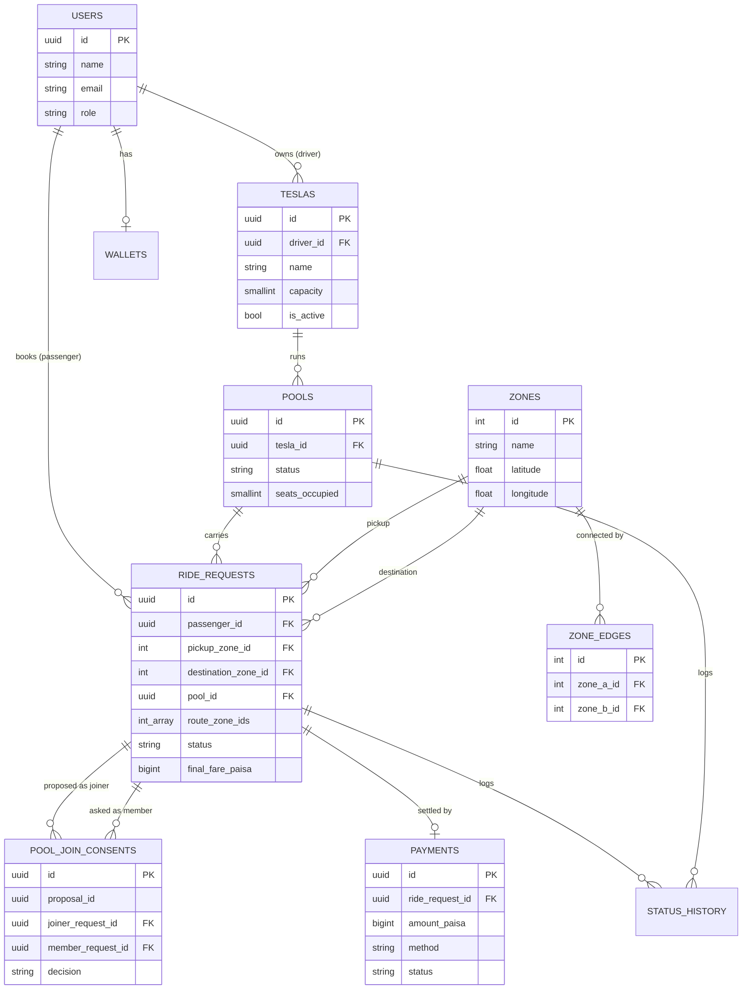
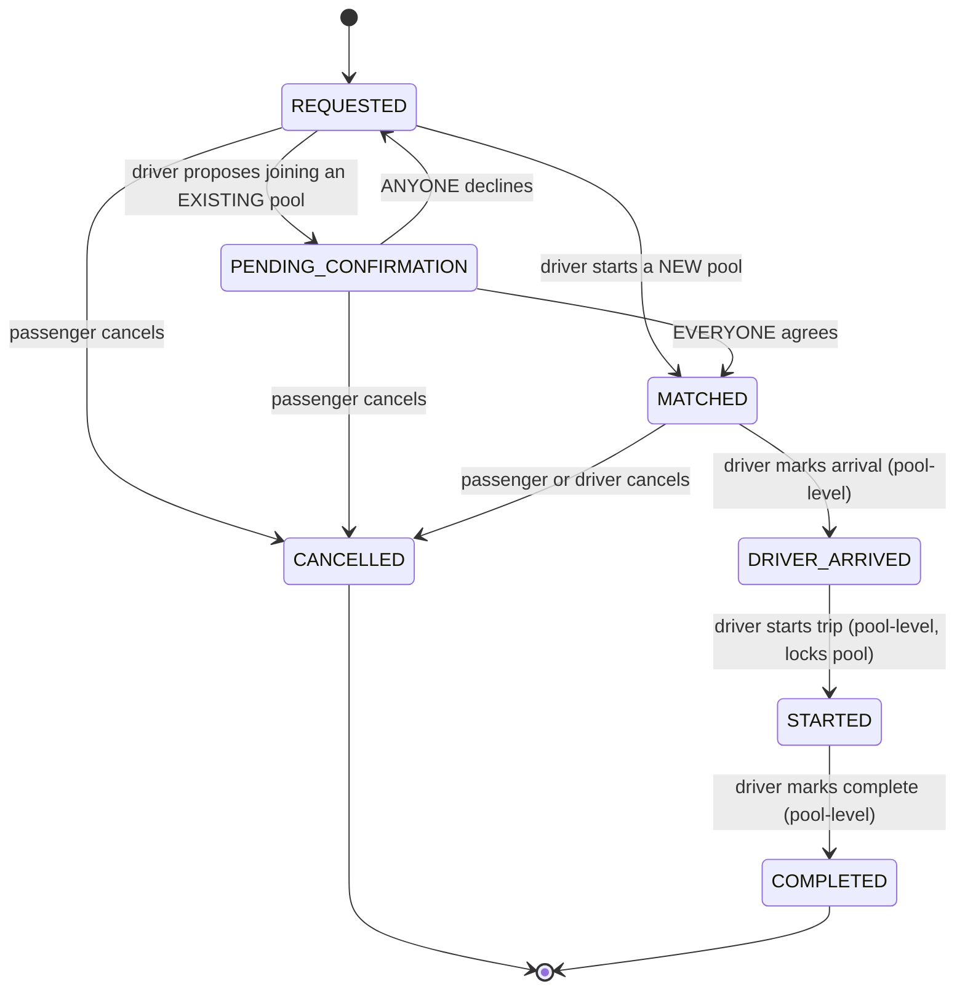
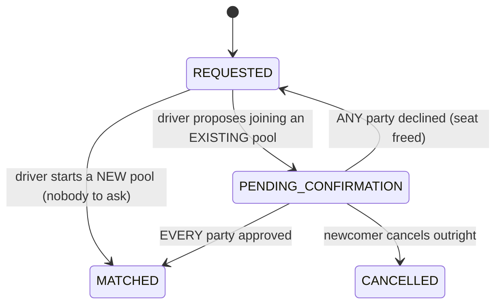

# Dhaka Tesla Pool — Schema, Lifecycle, Routing & Fare Model

Cast: **Jashim** (driver) owns **Bullet** (3-seat Tesla). **Nusrat** (Banani→Farmgate),
**Rafiq** (Mohakhali→Farmgate — picked up along the way), **Shirin**
(Banani→Bashundhara — a different branch entirely) are passengers. An earlier
version of this doc used Nusrat: Banani→Mohakhali and Rafiq: Banani→Gulshan 1
as the flagship pair; the junction-aware routing rule in section 6 shows why
that pair can't actually share a vehicle, so the example changed with it.

## 1. Entity-Relationship Diagram



**Why a `pools` table separate from `ride_requests`** instead of a pool-membership
join table: a `ride_request` can belong to at most one pool, ever (a passenger
doesn't switch Teslas mid-trip in this MVP), so it's a plain one-to-many via
`ride_requests.pool_id`. `pools` holds the trip-level facts (which Tesla, what
stage, how many seats are currently occupied) that the driver cares about and
that don't belong to any single passenger.

## 2. Ride / Pool Lifecycle

Two status fields, updated together but independently visible:

- **`pools.status`** — what stage *the Tesla's trip* is at (driver-facing).
- **`ride_requests.status`** — what stage *this passenger's booking* is at
  (passenger-facing; each passenger sees only their own row).



### Transition rules

| Transition | Actor | Guard |
|---|---|---|
| `REQUESTED → MATCHED` | driver | starting a NEW pool — nobody to ask. `seats_requested <= tesla.capacity`; the Tesla has no other active pool |
| `REQUESTED → PENDING_CONFIRMATION` | driver | joining an EXISTING `MATCHED` pool (not yet `DRIVER_ARRIVED`): the newcomer's route must merge with every current member's (section 6), no other proposal may be open, and `seats_occupied + seats_requested <= capacity` — checked and updated in one DB transaction. Opens a consent proposal (section 5) |
| `PENDING_CONFIRMATION → MATCHED` | passengers | **every** party — each existing member and the newcomer — has approved |
| `PENDING_CONFIRMATION → REQUESTED` | passengers | **any** party declined; seat freed, request returns to the open pool |
| `MATCHED → DRIVER_ARRIVED` | driver | applies to the whole pool; every `MATCHED` ride_request in it flips too. Blocked while any newcomer is still `PENDING_CONFIRMATION` |
| `DRIVER_ARRIVED → STARTED` | driver | pool is now locked — no further joins, fares are already final |
| `STARTED → COMPLETED` | driver | applies to the whole pool |
| `→ CANCELLED` | passenger or driver | only from `REQUESTED`, `PENDING_CONFIRMATION` or `MATCHED` ("cancel while valid" — Section 3). After `DRIVER_ARRIVED` a ride cannot be self-cancelled by the passenger in this MVP |

**Assumption (documented per Section 17):** pools stop accepting new passengers
once the driver has marked arrival. Letting people join after arrival would need
a mid-route re-pickup concept that's out of scope for the MVP; I'd revisit this
if the product wanted dynamic en-route matching.

**Every transition writes a `status_history` row** (`entity_type`, `entity_id`,
`from_status`, `to_status`, `changed_by`, timestamp) — this is what lets us
reconstruct "exactly what happened" after the fact (Section 2), independent of
the current-state columns on `pools`/`ride_requests`.

### Concurrency (Section 12/14 — Nusrat and Shirin both grab the last seat)

Handled with an atomic conditional update inside a single transaction, not a
read-then-write in application code:

```sql
UPDATE pools
SET seats_occupied = seats_occupied + :seats_requested
WHERE id = :pool_id
  AND seats_occupied + :seats_requested <= (
    SELECT capacity FROM teslas WHERE id = pools.tesla_id
  )
RETURNING seats_occupied;
```

If this returns 0 rows, the seat is gone and the request is rejected with a
clear "pool full" error — whichever of Nusrat/Shirin's requests reaches
Postgres first wins, and Postgres's row-level locking during the `UPDATE`
serializes the second one behind it. No optimistic-lock retry loop needed at
this scale. The `trg_pool_capacity` trigger in `schema.sql` is a second,
independent backstop in case any code path ever bypasses this pattern.
**At larger scale** I'd move seat-reservation into something like a Redis
`WATCH`/Lua-script counter per pool, or a proper distributed lock, to take
contention off the primary DB — but for an MVP a single `UPDATE ... WHERE`
inside a transaction is the right amount of complexity (Section 9: don't add
Redis/queues just to look advanced).

## 3. Fare Model

```
passengerFare = (baseFare + distanceCharge) × seatsRequested − poolDiscount
```

- **Storage**: all money as integer **paisa** (1 taka = 100 paisa), `BIGINT`
  columns, never `DECIMAL`/`FLOAT`. Splitting a pooled fare across passengers
  with floating point invites rounding drift that doesn't reconcile; integers
  make every calculation exact and hand-checkable.
- **`baseFare`**: flat fee per seat. Assumption: **3000 paisa (৳30)**.
- **`distanceCharge`**: `ratePerKm × distanceKm`, where `distanceKm` is the
  length of the request's **shortest path across the zone road graph**
  (section 6): the sum of the haversine distance of each edge along the way,
  each computed from its two zones' lat/lng. Assumption: **ratePerKm = 1500
  paisa/km (৳15/km)**. For two directly connected zones the path is a single
  edge, so the number is identical to the old straight-line figure — Banani →
  Mohakhali is still 1.448 km. For zones further apart it is now the real
  road-following distance, which is never shorter than the straight line
  (Banani → Farmgate is 4.438 km via Mohakhali, not a straight-line hop). Fare
  arithmetic takes the distance as an input; routing owns *how far*, the fare
  model owns *what that costs*.
- **Both `baseFare` and `distanceCharge` scale by `seatsRequested`.** A
  2-seat booking occupies twice the capacity of a 1-seat booking on the same
  route, so it costs twice as much. (**Correction**: this was a real bug
  caught by hand-testing after the fact, not something designed in from the
  start — `seatsRequested` was accepted by the API and stored on the
  ride_request, but never actually reached `computeBaseAndDistance`, so a
  1-seat and a 2-seat booking on an identical route billed identically.
  Fixed in `fareService.js` and its one call site in
  `rideRequestService.createRequest`. The fix itself needed a second pass:
  the first version rounded `rate × distance × seats` as one combined
  value, which doesn't reliably give exactly double for 2 seats vs. 1 —
  two independent roundings don't commute with multiplication, so they can
  drift a paisa apart. Fixed by rounding the *per-seat* distance charge
  once, then multiplying by an integer seat count — caught by the "costs
  exactly double" test itself failing on the first attempt.)
- **`poolDiscount`**: **20% of `distanceCharge`**, applied only if the pool's
  *final* membership has more than one passenger. "Final" is knowable for
  certain the moment the pool transitions `DRIVER_ARRIVED → STARTED`, because
  no new passenger can join after `DRIVER_ARRIVED` (see lifecycle rules
  below) — so at `STARTED` the backend computes each pool member's discount
  once, uniformly, from the pool's locked-in size. Before that point a
  passenger only sees an **estimate** (`baseFare + distanceCharge`, no
  discount assumed) so they have a number to look at while waiting to be
  matched, without the app promising a discount it can't yet guarantee.
  (Earlier draft of this doc locked the discount at `MATCHED` time instead —
  wrong, because it would have given an early-matched passenger like Nusrat
  no discount while a later-joining Rafiq got one, for the same pool. Fixed
  here before it reached the implementation.)

### Worked example (hand-checkable — verified against the running API, not hand-rounded)

Zone coordinates are in `seed/002_seed.sql`, road edges in the same file.
**Nusrat** rides Banani → Farmgate, whose shortest path is Banani → Mohakhali →
Farmgate. **Rafiq** is picked up at Mohakhali — *along the way* — and rides to
Farmgate too. His whole trip is the second half of hers, in the same direction,
so the two routes merge into one (section 6). Jashim marks `DRIVER_ARRIVED` then
`STARTED` with both in the pool, so the discount finalizes for both at that
point:

| Route | Path | Distance |
|---|---|---|
| Nusrat: Banani → Farmgate | Banani → Mohakhali → Farmgate | 1.448 + 2.991 = **4.438 km** |
| Rafiq: Mohakhali → Farmgate | Mohakhali → Farmgate | **2.991 km** |

**Nusrat**
- `baseFare` = 3000
- `distanceCharge` = round(1500 × 4.4384) = 6658
- `poolDiscount` = round(20% × 6658) = 1332
- `passengerFare` = 3000 + 6658 − 1332 = **8326 paisa = ৳83.26**
  (estimate shown before pooling: ৳96.58)

**Rafiq**
- `baseFare` = 3000
- `distanceCharge` = round(1500 × 2.9906) = 4486
- `poolDiscount` = round(20% × 4486) = 897
- `passengerFare` = 3000 + 4486 − 897 = **6589 paisa = ৳65.89**
  (estimate shown before pooling: ৳74.86)

These exact numbers are produced by `smoketest.sh` end to end against the real
API and Postgres, and pinned in `backend/tests/fare.test.js` and
`backend/tests/lifecycle.test.js`.

**Shirin** requests Banani → Bashundhara — a different branch off the Banani
junction. Her route can't merge with the pool's (section 6), so the driver's
attempt to add her is rejected with a 422 and she stays an open, solo request
(no `poolDiscount`), free to be picked up by another Tesla. This is the edge
case worth showing in the demo video (Section 13).

## 4. Payment

`payments.method` is `CASH` or `TESLAPAY` (simulated wallet — `wallets.balance_paisa`
debited on `paid_at`, no real payment gateway). `payments.status` starts
`PENDING` and flips to `PAID` either immediately for `TESLAPAY` (synchronous
debit) or manually by the driver for `CASH`.

## 5. Consent to pooling (all parties)

Not in the original brief — it came from two product questions asked while
using the running app. The first: why should the system ever match a passenger
who requested a solo trip with a stranger without asking? The second, after a
first fix: why is only the *newcomer* asked?

**Version 1 was one-sided, and that was a mistake.** It asked only the
passenger being added, on the reasoning that a pool's first member "already
consented by requesting a ride at all." That only covers sharing *in the
abstract*. Nusrat never agreed to share with Rafiq specifically, going where he
is going. The real reason I avoided asking her was that two-sided consent is
harder to build — not that it was wrong. It's now all-party.

**The rule**: when a driver proposes adding a passenger to a pool that already
has people in it, *every* affected party has to say yes — each existing member
and the newcomer. **Any single "no" removes the newcomer** from the pool and
returns them to `REQUESTED`.



A pool's very first member is the one case with nobody to ask, so it goes
straight to `MATCHED`.

**Storage** — `pool_join_consents` (`migrations/004`): one row per party per
proposal (`PENDING → ACCEPTED | DECLINED | VOID`), all sharing a `proposal_id`.
The joiner's own answer is a row too (`member_request_id = joiner_request_id`),
so every party is handled by exactly one mechanism rather than the newcomer
being a special case. `resolveProposal` (in `consentService`) looks at a
proposal's rows after each answer: any `DECLINED` → reject the joiner; all
`ACCEPTED` → promote them; otherwise keep waiting.

**Why a `proposal_id`.** A joiner can be proposed more than once (declined,
returned to `REQUESTED`, proposed again). Without a per-round id, a stale
`DECLINED` row from the first round would wrongly auto-reject the second. I
caught this reviewing my own first draft of the migration, before it shipped.

**The seat is reserved before anyone answers, not after.** Accepting a proposal
still runs the same atomic capacity check and increments `seats_occupied`
immediately — a pending newcomer counts against capacity, so a second action
can't oversell a seat just because the first newcomer hasn't been approved yet.
A decline frees it again in the same transaction.

**One open proposal per pool.** The driver can't propose a second newcomer
while the first is unresolved. Otherwise the existing members would be
consenting to a group that doesn't exist yet, and the second newcomer's
consent set would have to include someone who isn't a member yet.

**A member who cancels mid-proposal can't strand the newcomer.** Cancelling
voids that member's open question and re-evaluates each affected proposal — if
their answer was the only one outstanding, the newcomer is promoted rather than
left waiting for a reply that can never arrive. Likewise a newcomer who cancels
withdraws every question that was put to the others.

**Decline vs. cancel.** A newcomer *declining* (or being vetoed) goes back to
`REQUESTED` — they still want a ride, just not this pool. *Cancelling* ends the
request outright.

**A driver cannot mark arrival while any newcomer is `PENDING_CONFIRMATION`** —
arriving implies everyone actually coming has agreed to come.

**What each passenger sees.** An existing member gets a `pendingConsents` list
on `GET /ride-requests/mine`: who is being proposed, where they'd be picked up,
where they're going, and approve/reject buttons. The newcomer sees who they'd
be sharing with and, once they've answered, who hasn't yet (`waitingOn`).
Names and destinations only — never fares, which stay each passenger's own.

**Known limitation, deliberately not solved**: there is no timeout if someone
never answers — the driver just waits, and can't withdraw the proposal. A real
fix needs a background job (expire after N minutes, free the seat, notify the
driver), which is real added complexity for an MVP. Named as a next improvement.

**A real Postgres bug hit while building this, worth being able to explain**:
the first status-write used one `UPDATE` where a single parameter did double
duty — assigned to the enum column (`status = $2`) *and* compared against a text
literal in a `CASE` (`CASE WHEN $2 = 'MATCHED'…`) in the same statement.
Postgres's parameter-type inference doesn't cope with one placeholder in two
type contexts, and it failed with a real 500 the first time it ran. Fixed by
splitting into two explicit branches instead of one clever conditional one.

## 6. Route-aware pooling

**The gap this closes.** The original matching rule was "same pickup zone, and
destination in the same `cluster`" — a flat tag on each zone. It had no idea
of *order*, *direction*, or *junctions*. Picture a trunk road `a-b-c-d-e` with
a branch `c-f-g-h` splitting off at `c`. Someone going `a→d` and someone going
`b→e` obviously share a vehicle. Someone going `c→g` obviously can't join
either of them: continuing on to `d` or `e` and turning off onto the branch at
`c` are mutually exclusive, and getting from `e` to `f` means driving back to
`c` first. A cluster tag can't express that — it would have happily pooled all
three.

**The model.** Zones are graph nodes, and `zone_edges` (`migrations/003`) says
which pairs are *directly* road-connected. Edges are undirected and store no
distance: it's derived from the two zones' lat/lng with the same haversine
helper the fare model always used, so there's no second distance figure to keep
in sync. `cluster` was dropped from `zones` — leaving an unused, misleading
column around would be worse than removing it.

```
Gulshan 1 — Banani — Mohakhali — Farmgate — Dhanmondi
   |          |          |
Niketon   Bashundhara   Mirpur — Uttara
```

Banani (Gulshan 1 / Mohakhali / Bashundhara) and Mohakhali (Banani / Farmgate /
Mirpur) are genuine junctions, which is what lets the rule be demonstrated on
real data rather than only on abstract letters.

**Each request gets a path.** At creation, `routeService.shortestPath` runs
Dijkstra over the graph (O(V²), fine for nine zones; no priority queue needed)
and stores the ordered zone ids on `ride_requests.route_zone_ids`. The path's
length drives the fare (section 3); the path itself drives the matching rule.

**The compatibility rule** (`routeService.routesAreCompatible`): can every
request's directed path be served by *one* vehicle on *one* continuous,
non-branching route? Two checks:

1. **Shape.** Take the undirected union of every path's edges. It has to be a
   simple path: no zone may touch more than two distinct neighbours across all
   the paths combined (that would be a true branch point where the routes go
   three different ways), and the union has to be one connected piece. This is
   the check that rejects `c→g` joining `a→d`: `c` would touch `b`, `d` *and*
   `f`.
2. **Direction.** Shape alone isn't enough — a simple path can be driven either
   way, and every request has to travel the *same* way along it. Two riders
   who start at the same zone but head to opposite sides of it pass the shape
   check and fail here.

| Pair | Verdict | Why |
|---|---|---|
| `a→d` + `b→e` | pool | overlap along the trunk, same direction |
| `a→d` + `c→g` | **no** | `c` would have three neighbours |
| `b→e` + `c→g` | **no** | same |
| `a→c` + `c→g` | pool | the first trip *ends* at the junction, so nothing continues down the trunk |
| `a→d` + `d→b` | **no** | opposite directions along one road |
| Banani→Farmgate + Mohakhali→Farmgate | pool | second rider picked up along the way |
| Banani→Mohakhali + Banani→Mirpur | pool | Mirpur lies straight on past Mohakhali |
| Banani→Mohakhali + Banani→Gulshan 1 | **no** | same origin, opposite sides of Banani |
| Banani→Mohakhali + Banani→Bashundhara | **no** | different branches off Banani |

All of these are pinned in `backend/tests/routing.test.js` (the abstract
letters as pure-function tests, the Dhaka rows against the real seeded graph).

**A consequence I did not expect, worth being upfront about.** The flagship
example used through most of this project — Nusrat Banani→Mohakhali and Rafiq
Banani→Gulshan 1 — **fails this rule**. Both start at Banani, but Mohakhali and
Gulshan 1 are on opposite sides of it, so the vehicle would have to drop one and
drive back through the Banani junction to reach the other: exactly the
backtracking the rule exists to forbid. The old cluster tag only "worked"
because it never asked the question. Rather than quietly relax the rule to keep
the old example, the example changed (section 3). The rule also now allows
something the old one couldn't: **different pickup zones**. The old rule
required an identical pickup; the new one accepts anyone whose route merges,
including a rider picked up mid-route.

**Assumption: the road network is a tree** (no cycles). On a tree, any two
zones have exactly one simple path and the shape check is airtight. With cycles
(a ring road, say) two requests could have several possible routes and the
check would need to search over them, not just take the shortest. For a fixed
nine-zone graph that is a reasonable, documented simplification.

**A deliberate simplification, not a claim of optimality.** Real ride-pooling
systems accept *bounded* detours — a small zigzag to serve two nearby stops
beats refusing the pool outright. This rule is binary: no backtracking at all.
It's the conservative reading of "you can't go to f from e without backing
till c," and it errs toward rejecting a marginal pool rather than accepting a
bad one. A detour-ratio threshold (pool if total distance ≤ k × the sum of solo
distances) is the natural next step; it needs a small ordering search over
pickups and drop-offs, and a value of `k` that only real trip data could
justify — which is why it isn't guessed at here.

**Cost.** `loadGraph` re-reads zones and edges on each call rather than caching
them. The graph is tiny and effectively static, so that's cheaper than cache
invalidation at this scale; it would be the first thing to cache if it ever
showed up in a profile.

---

**Next**: see the README for setup, the API reference, and known limitations.
