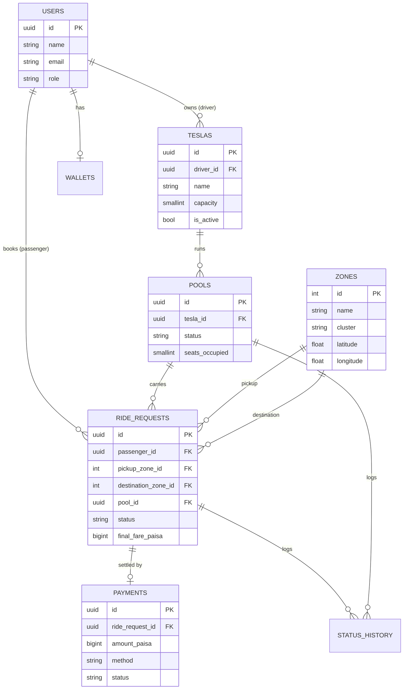
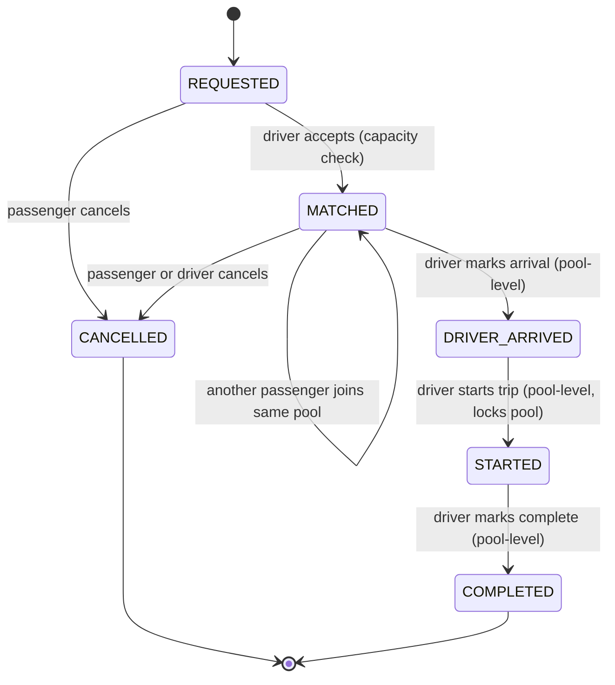

# Dhaka Tesla Pool — Schema, Lifecycle & Fare Model (v1)

Cast: **Jashim** (driver) owns **Bullet** (3-seat Tesla). **Nusrat** (Banani→Mohakhali),
**Rafiq** (Banani→Gulshan 1), **Shirin** (arrives 30s later) are passengers.

## 1. Entity-Relationship Diagram



**Why a `pools` table separate from `ride_requests`** instead of a pool-membership
join table: a `ride_request` can belong to at most one pool, ever (a passenger
doesn't switch Teslas mid-trip in this MVP), so it's a plain one-to-many via
`ride_requests.pool_id`. `pools` holds the trip-level facts (which Tesla, what
stage, how many seats are currently occupied) that the driver cares about and
that don't belong to any single passenger.

## 2. Ride / Pool Lifecycle

Two status fields, updated together but independently visible:

- **`pools.status`** — what stage *the Tesla's trip* is at (driver-facing).
- **`ride_requests.status`** — what stage *this passenger's booking* is at
  (passenger-facing; each passenger sees only their own row).



### Transition rules

| Transition | Actor | Guard |
|---|---|---|
| `REQUESTED → MATCHED` | driver | `pool.seats_occupied + seats_requested <= tesla.capacity`, checked and updated in one DB transaction |
| new request joins existing `MATCHED` pool | driver | pool must still be in `MATCHED` (not yet `DRIVER_ARRIVED`); same guard as above |
| `MATCHED → DRIVER_ARRIVED` | driver | applies to the whole pool; every `MATCHED` ride_request in it flips too |
| `DRIVER_ARRIVED → STARTED` | driver | pool is now locked — no further joins, fares are already final |
| `STARTED → COMPLETED` | driver | applies to the whole pool |
| `→ CANCELLED` | passenger or driver | only from `REQUESTED` or `MATCHED` ("cancel while valid" — Section 3). After `DRIVER_ARRIVED` a ride cannot be self-cancelled by the passenger in this MVP |

**Assumption (documented per Section 17):** pools stop accepting new passengers
once the driver has marked arrival. Letting people join after arrival would need
a mid-route re-pickup concept that's out of scope for the MVP; I'd revisit this
if the product wanted dynamic en-route matching.

**Every transition writes a `status_history` row** (`entity_type`, `entity_id`,
`from_status`, `to_status`, `changed_by`, timestamp) — this is what lets us
reconstruct "exactly what happened" after the fact (Section 2), independent of
the current-state columns on `pools`/`ride_requests`.

### Concurrency (Section 12/14 — Nusrat and Shirin both grab the last seat)

Handled with an atomic conditional update inside a single transaction, not a
read-then-write in application code:

```sql
UPDATE pools
SET seats_occupied = seats_occupied + :seats_requested
WHERE id = :pool_id
  AND seats_occupied + :seats_requested <= (
    SELECT capacity FROM teslas WHERE id = pools.tesla_id
  )
RETURNING seats_occupied;
```

If this returns 0 rows, the seat is gone and the request is rejected with a
clear "pool full" error — whichever of Nusrat/Shirin's requests reaches
Postgres first wins, and Postgres's row-level locking during the `UPDATE`
serializes the second one behind it. No optimistic-lock retry loop needed at
this scale. The `trg_pool_capacity` trigger in `schema.sql` is a second,
independent backstop in case any code path ever bypasses this pattern.
**At larger scale** I'd move seat-reservation into something like a Redis
`WATCH`/Lua-script counter per pool, or a proper distributed lock, to take
contention off the primary DB — but for an MVP a single `UPDATE ... WHERE`
inside a transaction is the right amount of complexity (Section 9: don't add
Redis/queues just to look advanced).

## 3. Fare Model

```
passengerFare = baseFare + distanceCharge - poolDiscount
```

- **Storage**: all money as integer **paisa** (1 taka = 100 paisa), `BIGINT`
  columns, never `DECIMAL`/`FLOAT`. Splitting a pooled fare across passengers
  with floating point invites rounding drift that doesn't reconcile; integers
  make every calculation exact and hand-checkable.
- **`baseFare`**: flat fee per ride request. Assumption: **3000 paisa (৳30)**.
- **`distanceCharge`**: `ratePerKm × distanceKm`, where `distanceKm` is the
  haversine straight-line distance between the request's pickup and
  destination zone centroids (`zones.latitude/longitude`). Assumption:
  **ratePerKm = 1500 paisa/km (৳15/km)**.
- **`poolDiscount`**: **20% of `distanceCharge`**, applied only if the pool
  has more than one passenger *at the moment this request's fare is locked*.
  Locked at `MATCHED` time and not recalculated later — a passenger who joins
  a solo trip doesn't retroactively raise or lower an already-matched
  passenger's fare. (Documented trade-off: this is simpler and more
  predictable for riders than dynamic re-splitting, at the cost of the pool
  discount not reflecting the pool's *final* size if it grows further.)

### Worked example (hand-checkable)

Zone centroids (from seed data) and haversine distance from Banani:

| Route | Distance |
|---|---|
| Banani → Mohakhali (Nusrat) | 1.5 km |
| Banani → Gulshan 1 (Rafiq) | 1.7 km |

Both requests match (same pickup zone `Banani`, destinations in the same
`gulshan_cluster`) and land in the same pool on Bullet, so both get the pool
discount:

**Nusrat**
- `baseFare` = 3000
- `distanceCharge` = 1500 × 1.5 = 2250
- `poolDiscount` = 20% × 2250 = 450
- `passengerFare` = 3000 + 2250 − 450 = **4800 paisa = ৳48.00**

**Rafiq**
- `baseFare` = 3000
- `distanceCharge` = 1500 × 1.7 = 2550
- `poolDiscount` = 20% × 2550 = 510
- `passengerFare` = 3000 + 2550 − 510 = **5040 paisa = ৳50.40**

**Shirin**, arriving 30s later requesting a route *outside* the
`gulshan_cluster` (e.g. to Mirpur), fails the matching rule and does **not**
join Bullet's pool — she gets a new solo request (no `poolDiscount`) or is
queued for another Tesla. This is the edge case worth showing in the demo
video (Section 13).

## 4. Payment

`payments.method` is `CASH` or `TESLAPAY` (simulated wallet — `wallets.balance_paisa`
debited on `paid_at`, no real payment gateway). `payments.status` starts
`PENDING` and flips to `PAID` either immediately for `TESLAPAY` (synchronous
debit) or manually by the driver for `CASH`.

---

**Next**: Docker Compose (app + Postgres + migrations + seed data for
Jashim/Bullet/Nusrat/Rafiq/Shirin), then the Express API implementing the
transitions above.
