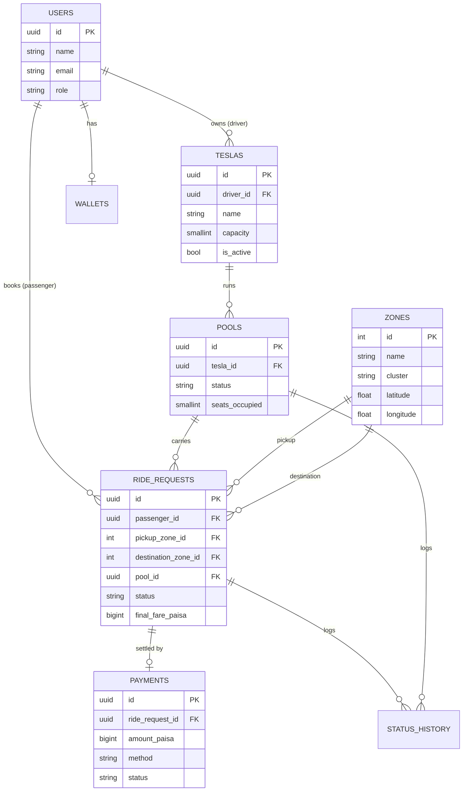
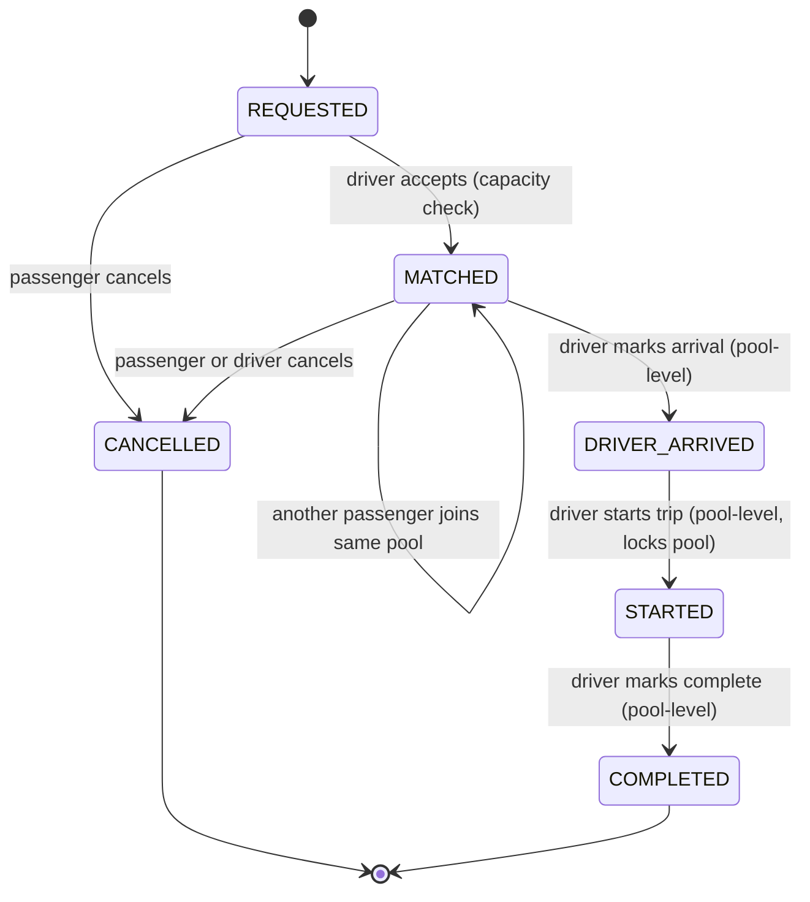
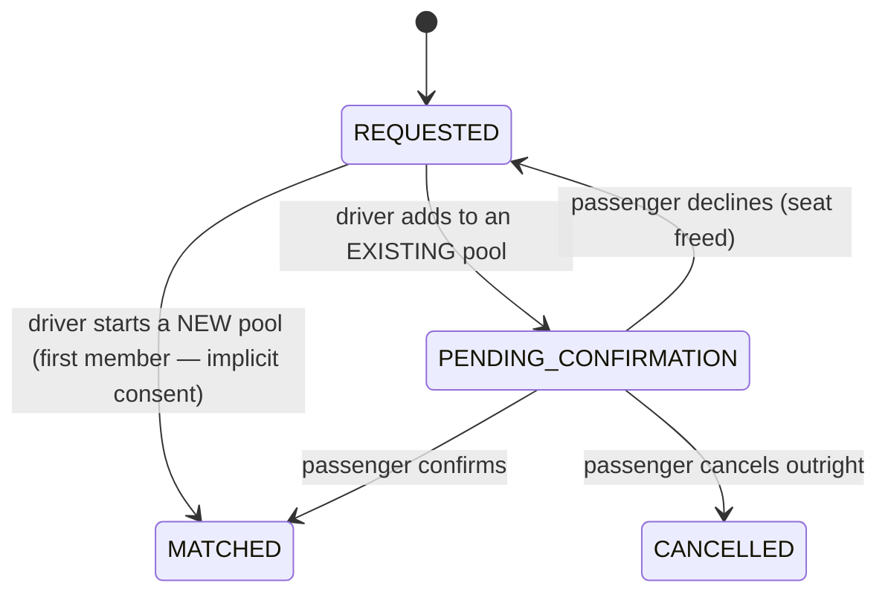

# Dhaka Tesla Pool — Schema, Lifecycle & Fare Model (v1)

Cast: **Jashim** (driver) owns **Bullet** (3-seat Tesla). **Nusrat** (Banani→Mohakhali),
**Rafiq** (Banani→Gulshan 1), **Shirin** (arrives 30s later) are passengers.

## 1. Entity-Relationship Diagram



**Why a `pools` table separate from `ride_requests`** instead of a pool-membership
join table: a `ride_request` can belong to at most one pool, ever (a passenger
doesn't switch Teslas mid-trip in this MVP), so it's a plain one-to-many via
`ride_requests.pool_id`. `pools` holds the trip-level facts (which Tesla, what
stage, how many seats are currently occupied) that the driver cares about and
that don't belong to any single passenger.

## 2. Ride / Pool Lifecycle

Two status fields, updated together but independently visible:

- **`pools.status`** — what stage *the Tesla's trip* is at (driver-facing).
- **`ride_requests.status`** — what stage *this passenger's booking* is at
  (passenger-facing; each passenger sees only their own row).



### Transition rules

| Transition | Actor | Guard |
|---|---|---|
| `REQUESTED → MATCHED` | driver | `pool.seats_occupied + seats_requested <= tesla.capacity`, checked and updated in one DB transaction |
| new request joins existing `MATCHED` pool | driver | pool must still be in `MATCHED` (not yet `DRIVER_ARRIVED`); same guard as above |
| `MATCHED → DRIVER_ARRIVED` | driver | applies to the whole pool; every `MATCHED` ride_request in it flips too |
| `DRIVER_ARRIVED → STARTED` | driver | pool is now locked — no further joins, fares are already final |
| `STARTED → COMPLETED` | driver | applies to the whole pool |
| `→ CANCELLED` | passenger or driver | only from `REQUESTED` or `MATCHED` ("cancel while valid" — Section 3). After `DRIVER_ARRIVED` a ride cannot be self-cancelled by the passenger in this MVP |

**Assumption (documented per Section 17):** pools stop accepting new passengers
once the driver has marked arrival. Letting people join after arrival would need
a mid-route re-pickup concept that's out of scope for the MVP; I'd revisit this
if the product wanted dynamic en-route matching.

**Every transition writes a `status_history` row** (`entity_type`, `entity_id`,
`from_status`, `to_status`, `changed_by`, timestamp) — this is what lets us
reconstruct "exactly what happened" after the fact (Section 2), independent of
the current-state columns on `pools`/`ride_requests`.

### Concurrency (Section 12/14 — Nusrat and Shirin both grab the last seat)

Handled with an atomic conditional update inside a single transaction, not a
read-then-write in application code:

```sql
UPDATE pools
SET seats_occupied = seats_occupied + :seats_requested
WHERE id = :pool_id
  AND seats_occupied + :seats_requested <= (
    SELECT capacity FROM teslas WHERE id = pools.tesla_id
  )
RETURNING seats_occupied;
```

If this returns 0 rows, the seat is gone and the request is rejected with a
clear "pool full" error — whichever of Nusrat/Shirin's requests reaches
Postgres first wins, and Postgres's row-level locking during the `UPDATE`
serializes the second one behind it. No optimistic-lock retry loop needed at
this scale. The `trg_pool_capacity` trigger in `schema.sql` is a second,
independent backstop in case any code path ever bypasses this pattern.
**At larger scale** I'd move seat-reservation into something like a Redis
`WATCH`/Lua-script counter per pool, or a proper distributed lock, to take
contention off the primary DB — but for an MVP a single `UPDATE ... WHERE`
inside a transaction is the right amount of complexity (Section 9: don't add
Redis/queues just to look advanced).

## 3. Fare Model

```
passengerFare = (baseFare + distanceCharge) × seatsRequested − poolDiscount
```

- **Storage**: all money as integer **paisa** (1 taka = 100 paisa), `BIGINT`
  columns, never `DECIMAL`/`FLOAT`. Splitting a pooled fare across passengers
  with floating point invites rounding drift that doesn't reconcile; integers
  make every calculation exact and hand-checkable.
- **`baseFare`**: flat fee per seat. Assumption: **3000 paisa (৳30)**.
- **`distanceCharge`**: `ratePerKm × distanceKm`, where `distanceKm` is the
  haversine straight-line distance between the request's pickup and
  destination zone centroids (`zones.latitude/longitude`). Assumption:
  **ratePerKm = 1500 paisa/km (৳15/km)**.
- **Both `baseFare` and `distanceCharge` scale by `seatsRequested`.** A
  2-seat booking occupies twice the capacity of a 1-seat booking on the same
  route, so it costs twice as much. (**Correction**: this was a real bug
  caught by hand-testing after the fact, not something designed in from the
  start — `seatsRequested` was accepted by the API and stored on the
  ride_request, but never actually reached `computeBaseAndDistance`, so a
  1-seat and a 2-seat booking on an identical route billed identically.
  Fixed in `fareService.js` and its one call site in
  `rideRequestService.createRequest`. The fix itself needed a second pass:
  the first version rounded `rate × distance × seats` as one combined
  value, which doesn't reliably give exactly double for 2 seats vs. 1 —
  two independent roundings don't commute with multiplication, so they can
  drift a paisa apart. Fixed by rounding the *per-seat* distance charge
  once, then multiplying by an integer seat count — caught by the "costs
  exactly double" test itself failing on the first attempt.)
- **`poolDiscount`**: **20% of `distanceCharge`**, applied only if the pool's
  *final* membership has more than one passenger. "Final" is knowable for
  certain the moment the pool transitions `DRIVER_ARRIVED → STARTED`, because
  no new passenger can join after `DRIVER_ARRIVED` (see lifecycle rules
  below) — so at `STARTED` the backend computes each pool member's discount
  once, uniformly, from the pool's locked-in size. Before that point a
  passenger only sees an **estimate** (`baseFare + distanceCharge`, no
  discount assumed) so they have a number to look at while waiting to be
  matched, without the app promising a discount it can't yet guarantee.
  (Earlier draft of this doc locked the discount at `MATCHED` time instead —
  wrong, because it would have given an early-matched passenger like Nusrat
  no discount while a later-joining Rafiq got one, for the same pool. Fixed
  here before it reached the implementation.)

### Worked example (hand-checkable — verified against the running API, not hand-rounded)

Zone centroids are in `seed/002_seed.sql`. Haversine distance from Banani
(23.7936, 90.4066):

| Route | Distance |
|---|---|
| Banani → Mohakhali (Nusrat) | 1.448 km |
| Banani → Gulshan 1 (Rafiq) | 1.711 km |

Both requests match (same pickup zone `Banani`, destinations in the same
`gulshan_cluster`) and land in the same pool on Bullet. Jashim marks
`DRIVER_ARRIVED` then `STARTED` with both still in the pool, so the discount
finalizes for both of them at that point:

**Nusrat**
- `baseFare` = 3000
- `distanceCharge` = round(1500 × 1.448) = 2172
- `poolDiscount` = round(20% × 2172) = 434
- `passengerFare` = 3000 + 2172 − 434 = **4738 paisa = ৳47.38**

**Rafiq**
- `baseFare` = 3000
- `distanceCharge` = round(1500 × 1.711) = 2567
- `poolDiscount` = round(20% × 2567) = 513
- `passengerFare` = 3000 + 2567 − 513 = **5054 paisa = ৳50.54**

These exact numbers were reproduced by an end-to-end run against the actual
API and Postgres (seed data → login → request → accept → arrive → start),
not computed by hand separately from the code — see `smoketest.sh`.

**Shirin**, arriving 30s later requesting a route *outside* the
`gulshan_cluster` (e.g. to Mirpur), fails the matching rule and does **not**
join Bullet's pool — she gets a new solo request (no `poolDiscount`) or is
queued for another Tesla. This is the edge case worth showing in the demo
video (Section 13).

## 4. Payment

`payments.method` is `CASH` or `TESLAPAY` (simulated wallet — `wallets.balance_paisa`
debited on `paid_at`, no real payment gateway). `payments.status` starts
`PENDING` and flips to `PAID` either immediately for `TESLAPAY` (synchronous
debit) or manually by the driver for `CASH`.

## 5. Passenger consent to pooling

Not in the original brief — added after a genuinely good product question:
if a passenger requests a solo trip, why should the system ever match them
with a stranger without asking first? The original design didn't ask —
`acceptRequest` matched a passenger into an existing pool unconditionally,
the same way it created a brand-new one.

**The fix**: a new `ride_request_status` value, `PENDING_CONFIRMATION`
(`migrations/002_add_pending_confirmation_status.sql`), inserted between
`REQUESTED` and `MATCHED` — but only on one of the two paths through
`acceptRequest`:



**Why the asymmetry**: a pool's first member already consented to sharing
the moment they requested a ride at all — that's the product's whole
premise. It's only the *second* passenger, being added to a pool with a
stranger already in it, who's agreeing to something they didn't know about
when they made their request. Requiring confirmation from both members of
every pool would mean the driver waits on two separate confirmations
instead of one, with no clean way to handle one accepting and one
refusing — asking only the newcomer avoids that entirely.

**The seat is reserved before consent, not after.** `acceptRequest` still
runs the same atomic capacity check and increments `seats_occupied`
immediately — the difference is only which `ride_request.status` value it
writes afterward. This preserves the concurrency guarantee (Section on
Concurrency, above) without complicating it: a pending invitation still
counts against capacity, so a second driver action can't accept a request
into a pool that's actually full just because the first occupant hasn't
confirmed yet.

**Decline vs. cancel, and why they're different**: declining
(`POST /ride-requests/:id/decline`) frees the seat and returns the
ride_request to `REQUESTED` — the passenger still wants a ride, just not
this particular pool, so the driver can offer them a different one later.
Cancelling (`PATCH /ride-requests/:id/cancel`, already valid from
`PENDING_CONFIRMATION` too) ends the request outright. Both free the seat
the same way — the only difference is where the ride_request lands
afterward.

**A driver cannot mark arrival while anyone in the pool is still
`PENDING_CONFIRMATION`** — arriving implies everyone actually coming has
agreed to come. Enforced in `poolService.transitionPool` as a guard on the
`MATCHED → DRIVER_ARRIVED` transition specifically.

**Visibility, bundled in alongside consent**: while building this, a
related gap became obvious — a passenger couldn't see who they were pooled
with even *after* being matched, since that information only ever existed
on the driver's pool-detail view. `rideRequestService` now attaches a
`poolmates` array (name + destination only, never fares — that's each
passenger's own private data) to both `GET /ride-requests/mine` and
`GET /ride-requests/:id`.

**Known limitation, deliberately not solved**: there's no timeout if a
passenger never responds to a pending invitation — the driver is just stuck
waiting, with no automatic fallback. A real fix needs a background job
(expire after N minutes, free the seat, notify the driver), which is real
added complexity for an MVP. Named here as a next improvement rather than
built, same reasoning as not building websockets or a matching queue.

**A real bug caught building this, worth being able to explain**: the first
version of the status-write used one `UPDATE` with a single parameter doing
double duty — assigned to the enum column (`status = $2`) *and* compared
against a text literal in a `CASE` expression (`CASE WHEN $2 = 'MATCHED'...`)
in the same statement. Postgres's parameter-type inference doesn't handle a
placeholder appearing in two different type contexts within one statement
well, and this failed with a real `500` the first time it actually ran
against Postgres — not a hypothetical, an actual crash caught by running the
new lifecycle tests. Fixed by splitting into two explicit branches (one
`UPDATE` for the `MATCHED` case, one for `PENDING_CONFIRMATION`) instead of
one clever conditional one — see `poolService.acceptRequest`.

---

**Next**: Docker Compose (app + Postgres + migrations + seed data for
Jashim/Bullet/Nusrat/Rafiq/Shirin), then the Express API implementing the
transitions above.
