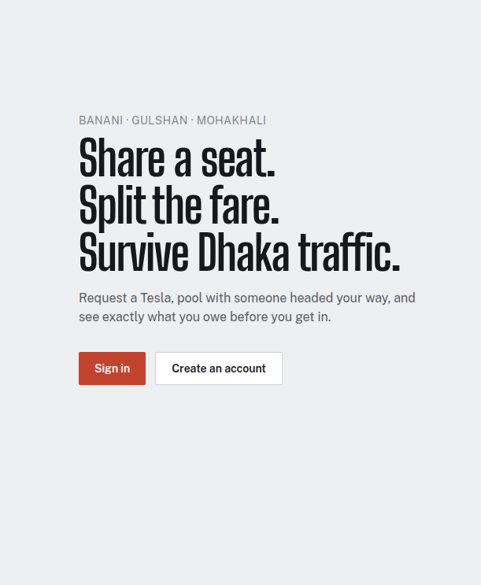
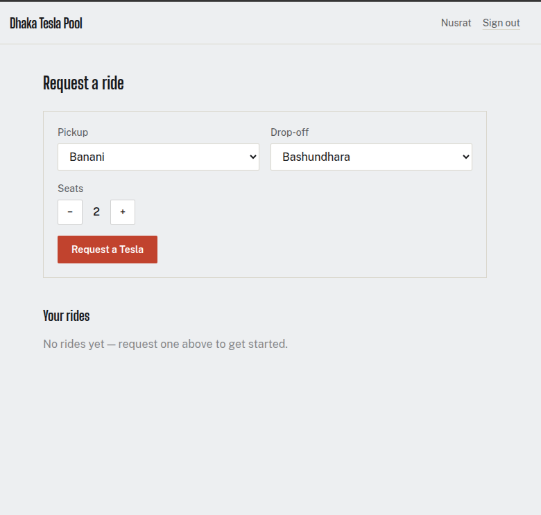
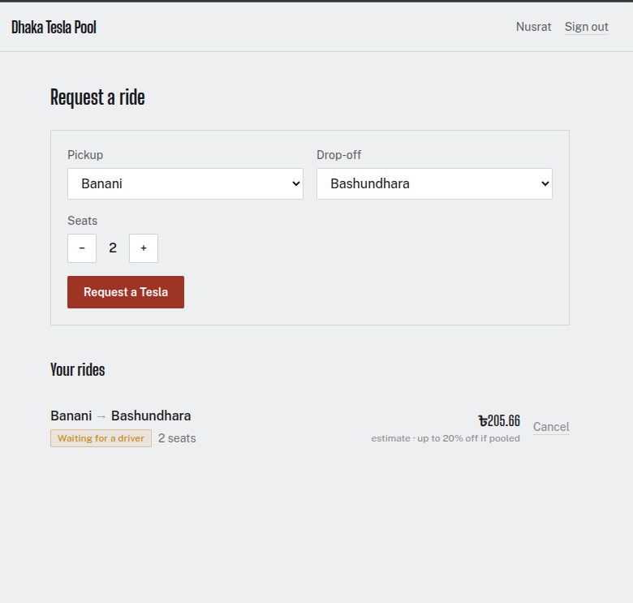
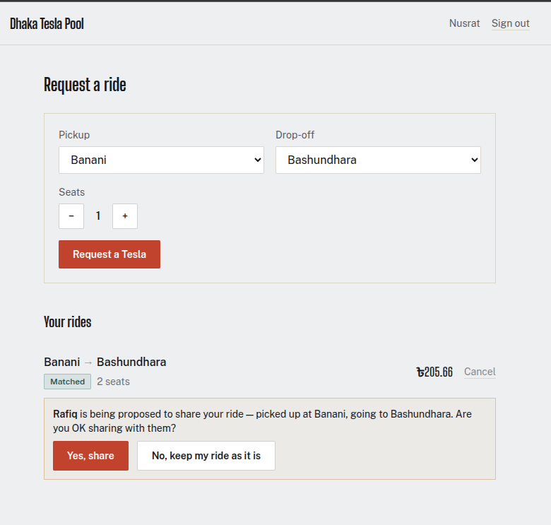
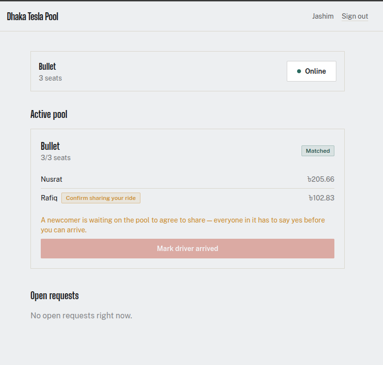
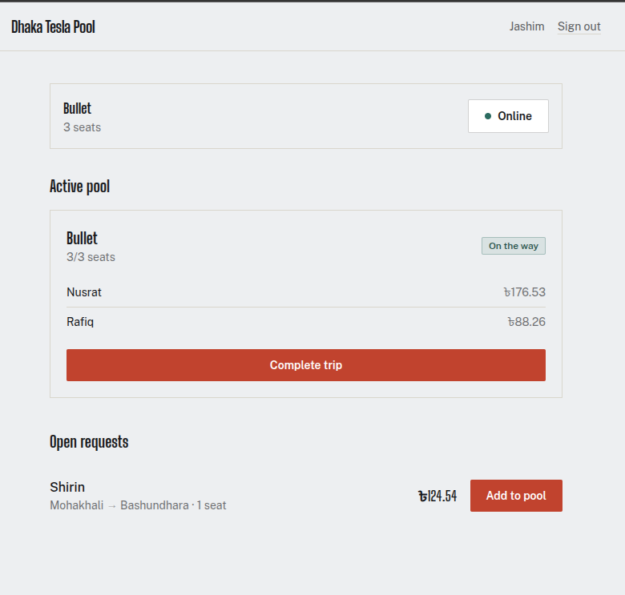
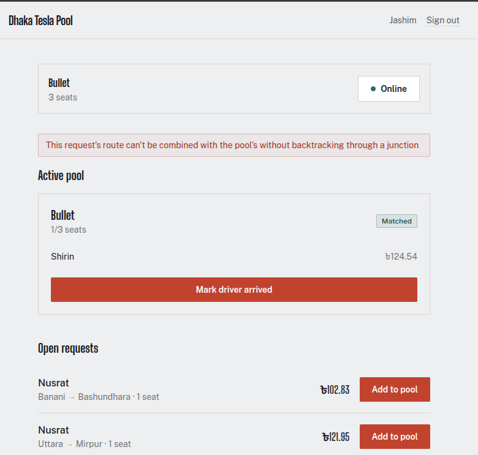
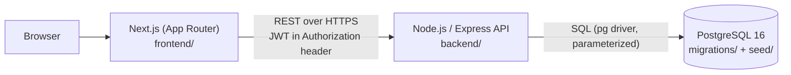
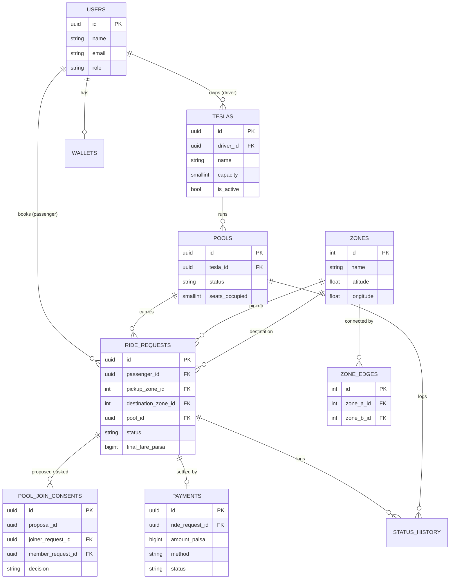
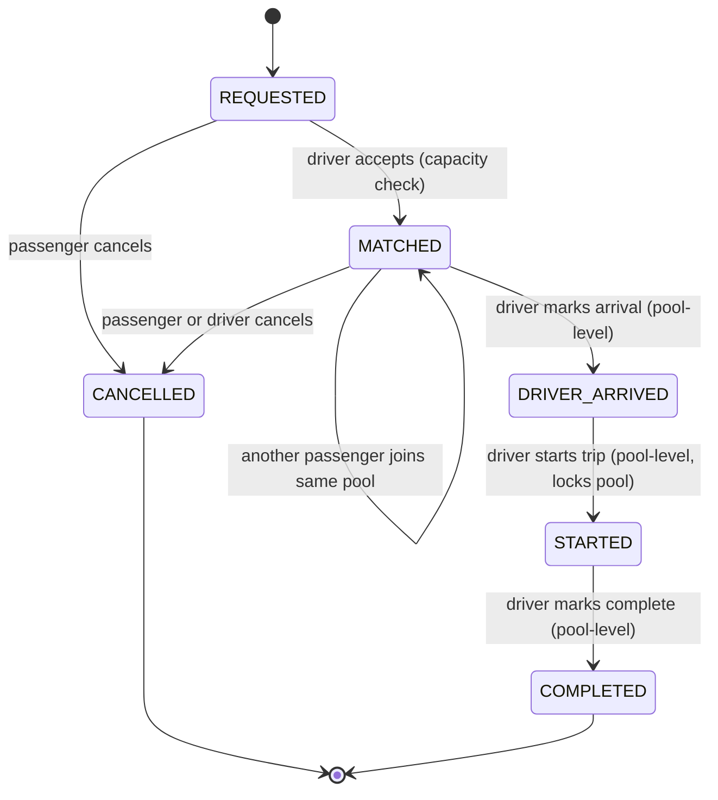

# Dhaka Tesla Pool

Share a seat. Split the fare. Survive Dhaka traffic.

An MVP ride-pooling platform built around three actors — Passenger, Driver/Tesla,
and Ride/Pool — for the Banani rush-hour scenario: Jashim drives Bullet, a
3-seat battery rickshaw. Nusrat and Rafiq book overlapping-but-not-identical
trips and get pooled together; Shirin's incompatible route gets correctly
rejected from their pool.

## Table of contents

- [Problem statement](#problem-statement)
- [Features implemented](#features-implemented)
- [Screenshots](#screenshots)
- [Architecture](#architecture)
- [Database design (ERD)](#database-design-erd)
- [Ride lifecycle](#ride-lifecycle)
- [Fare model](#fare-model)
- [Tech stack & choices](#tech-stack--choices)
- [Project structure](#project-structure)
- [Prerequisites](#prerequisites)
- [Environment variables](#environment-variables)
- [Running with Docker (recommended)](#running-with-docker-recommended)
- [Running locally without Docker](#running-locally-without-docker)
- [Running tests](#running-tests)
- [Demo credentials](#demo-credentials)
- [API overview](#api-overview)
- [Concurrency](#concurrency)
- [Key decisions & trade-offs](#key-decisions--trade-offs)
- [Known limitations](#known-limitations)
- [Next improvements](#next-improvements)
- [Deployment](#deployment)
- [Git workflow](#git-workflow)
- [AI usage](#ai-usage)
- [Demo video](#demo-video)

## Problem statement

Nusrat wants to get from Banani to Mohakhali. Rafiq wants to get from Banani
to Gulshan 1. Jashim's Bullet has three seats. Passengers should be able to
request a ride and, when it makes sense, share a Tesla with someone else. The
driver needs to see who's assigned to the ride and what stage it's at. Each
passenger needs to see only their own fare and status. Once a ride wraps up,
the system holds onto enough history to explain exactly what happened.

## Features implemented

**Passenger**
- Sign up / sign in
- Request a ride (pickup, destination, seats) and see an estimated fare
  immediately, including a note that pooling can take up to 20% off
- Track status: `REQUESTED → [PENDING_CONFIRMATION] → MATCHED → DRIVER_ARRIVED → STARTED → COMPLETED`, or `CANCELLED`
- **All-party consent before sharing**: if a driver wants to add you to a pool
  that already has people in it, *everyone* has to agree — each existing
  member and you. Your ride sits in `PENDING_CONFIRMATION`; see who you'd be
  sharing with, confirm or decline. A single "no" from anyone removes you from
  the pool and frees your seat back to `REQUESTED`. Only applies when joining
  an *existing* pool — starting a fresh one is instant, nobody to ask yet
- See who you're currently sharing a ride with, once matched
- View ride history
- Cancel while the cancellation is still valid (before the driver arrives —
  including while still deciding on a pool invitation)

**Driver / Tesla**
- Sign in, register a Tesla (name + fixed seat capacity), go online/offline
- See open (unmatched) requests
- Accept a request into a new pool, or add a compatible request to the Tesla's
  existing active pool (the added passenger must confirm before you can arrive)
- See and answer proposals for adding a new passenger to your ride, once
  matched into a pool
- Mark driver-arrived → start trip → complete trip
- See current pool's passengers, seats, confirmation status, and each
  passenger's fare

**Pool / Ride split**
- Multiple requests can share one Tesla, matched by a real road-graph rule
  (not a flat area tag) — see [Route-aware pooling](DESIGN.md#6-route-aware-pooling)
- Occupied seats can never exceed the Tesla's capacity — enforced atomically
  even under concurrent requests for the same last seat, and reserved the
  moment a driver accepts, before the added passenger has even responded
- A Tesla can only run one active pool at a time
- Each passenger gets an individually computed fare, correctly scaled by
  seats requested; the pool discount finalizes once the trip starts (see
  [Fare model](#fare-model))
- Every status change is written to an append-only audit log

## Screenshots

The screens below use the seeded story cast (Nusrat, Rafiq, Shirin, Jashim and his Tesla, Bullet).

**Passenger**


*Landing page with sign-in and account creation.*


*Nusrat picks a pickup zone, a drop-off zone and the number of seats.*


*The request shows its status, seat count and an estimated fare (৳205.66 for 2 seats), with a note that pooling can take up to 20% off the distance charge. She can cancel while the request is still valid.*


*Rafiq is proposed as a pool-mate. Nusrat, already matched, is asked whether she agrees to share, and can say no and keep her ride as it is.*

**Driver**


*Jashim's view of Bullet: 3/3 seats are reserved, Rafiq is marked "Confirm sharing your ride", and "Mark driver arrived" is disabled until everyone in the pool has agreed.*


*After the trip starts, the pool discount is applied: Nusrat's fare is ৳176.53 and Rafiq's ৳88.26. Open requests, such as Shirin's, are listed below.*

**Edge case**


*Adding a request whose route would need backtracking through a junction is rejected with a clear message, and the pool stays as it was.*

## Architecture



Three independent services (`web`, `api`, `db`), each in its own Docker
container, wired together by `docker-compose.yml` at the project root. The
frontend never talks to the database directly — everything goes through the
API, which is the only thing with a database credential.

## Database design (ERD)



Full column-level detail, constraints, and indexes: [`migrations/001_init.sql`](migrations/001_init.sql)
(plus [`migrations/002_add_pending_confirmation_status.sql`](migrations/002_add_pending_confirmation_status.sql),
which adds the `PENDING_CONFIRMATION` status used for passenger consent — see
[Passenger consent to pooling](DESIGN.md#5-passenger-consent-to-pooling)).
Design rationale for every table: [`DESIGN.md`](DESIGN.md).

## Ride lifecycle



Two status fields track this: `pools.status` (driver-facing — what stage the
Tesla's trip is at) and `ride_requests.status` (passenger-facing — what stage
*this passenger's* booking is at). Full transition-rule table in
[`DESIGN.md`](DESIGN.md#2-ride--pool-lifecycle).

## Fare model

```
passengerFare = (baseFare + distanceCharge) × seatsRequested − poolDiscount
```

- All money stored as **integer paisa** (1 taka = 100 paisa) — never
  floating point, to keep pool-split arithmetic exact.
- `baseFare` = 3000 paisa (৳30) per seat.
- `distanceCharge` = 1500 paisa/km (৳15/km) × the length of the request's
  **shortest path across the zone road graph** (not a single straight-line
  hop — see [Route-aware pooling](DESIGN.md#6-route-aware-pooling)), also
  scaled per seat.
- `poolDiscount` = 20% of `distanceCharge`, applied only once the pool's
  membership is final — at the `DRIVER_ARRIVED → STARTED` transition, since
  no one can join after `DRIVER_ARRIVED`. Before that, the passenger sees an
  honest **estimate** (base + distance, no discount assumed).

**Worked example** (verified end-to-end against the running API, not
hand-rounded — see `smoketest.sh` and `backend/tests/fare.test.js`). Nusrat
rides Banani→Farmgate (via the Mohakhali junction); Rafiq is picked up along
the way at Mohakhali, also to Farmgate — his whole trip is the second half of
hers, so the two routes merge (section 6):

| | Path | Distance | Base | Distance charge | Discount | Final fare |
|---|---|---|---|---|---|---|
| Nusrat | Banani→Mohakhali→Farmgate | 4.438 km | ৳30.00 | ৳66.58 | −৳13.32 | **৳83.26** |
| Rafiq | Mohakhali→Farmgate | 2.991 km | ৳30.00 | ৳44.86 | −৳8.97 | **৳65.89** |

Full derivation: [`DESIGN.md`](DESIGN.md#3-fare-model).

## Tech stack & choices

| Layer | Choice | Alternatives considered | Why this fits an MVP | What would make me switch |
|---|---|---|---|---|
| Frontend | Next.js 14 (App Router), plain JS, Tailwind | Plain React + a router; Vue; TypeScript | Built-in routing/SSR scaffolding needs no extra setup; plain JS is less ceremony for a project this size — types would mostly restate what the API already validates | If the API contract kept changing or the team grew, TypeScript + a generated client from the API schema |
| Backend | Node.js + Express | Fastify, NestJS | Minimal, unopinionated, easy to explain every line of; NestJS's DI/decorators are overhead this scope doesn't need | NestJS if the service surface grew past ~5x this size and needed enforced structure |
| Database | PostgreSQL 16 | MySQL, SQLite, MongoDB | Relational integrity (FKs, checks, a trigger) matters directly for "never exceed capacity"; row-level locking is the concurrency fix. Mongo has no equivalent transactional guarantee without extra machinery | — Postgres scales well past MVP; unlikely to switch |
| DB access | Raw `pg` driver, hand-written SQL | Prisma, Drizzle, Knex | The schema uses a generated column and a trigger that ORMs handle awkwardly or not at all; hand-written SQL means every query is exactly what it says, useful when defending it live | Prisma/Drizzle once the query surface got large enough that hand-writing every statement became the bottleneck, not the safety net |
| Migrations | Numbered plain-SQL files, run via Postgres's `docker-entrypoint-initdb.d` | node-pg-migrate, Prisma Migrate | Zero extra dependency; schema is still young enough that "one init file" is honest about its current maturity | node-pg-migrate the moment there's a second migration to layer on top of the first — plain init scripts only run once, they don't handle incremental changes |
| Auth | JWT, `bcrypt` password hashing | Session cookies + server-side store | Stateless — no session store needed for an MVP; simple to verify per-request | httpOnly cookies + CSRF protection before this ever went to production (JWT-in-localStorage is readable by any JS on the page — documented trade-off, see Limitations) |
| Testing | Node's built-in `node:test` + `supertest` | Jest, Mocha | No extra dependency (Node 20+ ships `node:test`); `supertest` drives the real Express app in-process, so tests exercise real routing/middleware, not mocks | Jest if the suite needed snapshot testing or a broader ecosystem of matchers |
| Styling | Tailwind, custom token set | CSS Modules, styled-components | Fast to keep consistent across many small components; token set defined once in `tailwind.config.js` rather than scattered | — |
| Deployment | Docker Compose (local/reproducible) | Render, Railway, Fly.io free tiers | See [Deployment](#deployment) | Once picking a specific free-tier host, whichever one keeps the Postgres add-on genuinely free at this scale |

## Project structure

```
.
├── docker-compose.yml       # wires db + api + web together
├── DESIGN.md                 # schema rationale, lifecycle rules, routing, fare
├── migrations/
│   ├── 001_init.sql          # full schema: tables, constraints, indexes, trigger
│   ├── 002_add_pending_confirmation_status.sql  # PENDING_CONFIRMATION status
│   ├── 003_add_zone_routing.sql                 # zone_edges graph, drops cluster
│   └── 004_add_pool_join_consents.sql           # all-party consent table
├── seed/
│   └── 002_seed.sql          # zones + Jashim/Bullet/Nusrat/Rafiq/Shirin
├── scripts/
│   └── setup-test-db.sh      # creates + migrates + seeds a dedicated test DB
├── backend/
│   ├── src/
│   │   ├── app.js / server.js
│   │   ├── config/db.js      # single shared pg.Pool
│   │   ├── middleware/       # auth (JWT), central error handler
│   │   ├── routes/           # URL → controller wiring, role guards
│   │   ├── controllers/      # thin HTTP adapters
│   │   ├── services/         # all business logic lives here
│   │   └── utils/            # haversine, ApiError, asyncHandler
│   ├── tests/                # fare, routing, and full lifecycle integration tests
│   └── smoketest.sh          # manual end-to-end story run against a live API
└── frontend/
    ├── app/                   # Next.js App Router pages
    ├── components/            # presentational, no fetching
    └── lib/                   # api.js, AuthContext.jsx, format.js
```

`smoketest.sh` at the project root is a manual, exploratory end-to-end run
of the Banani story against a live API + Postgres (separate from the
automated suite in `backend/tests/`) — used while building and verifying
the concurrency and fare-lock logic.

## Prerequisites

- Docker + Docker Compose (recommended path), **or**
- Node.js 20+ and a local PostgreSQL 16 instance (manual path)

## Environment variables

Never commit real values — only `*.example` files are committed.

**`backend/.env.example`**
```
NODE_ENV=development
PORT=4000
DATABASE_URL=postgresql://tesla:tesla@db:5432/dhaka_tesla_pool
JWT_SECRET=change_me_dev_only
JWT_EXPIRES_IN=7d
```

**`backend/.env.test.example`** — same shape, points at a separate
`dhaka_tesla_pool_test` database so tests never touch dev/seed data.

**`frontend/.env.local.example`**
```
NEXT_PUBLIC_API_URL=http://localhost:4000
```
Note: `NEXT_PUBLIC_*` values are baked into the client bundle at **build**
time, not read at container start — in Docker this is passed as a build
`arg`, not a runtime `environment:` entry (see `docker-compose.yml`).

## Running with Docker (recommended)

```bash
cp backend/.env.example backend/.env   # not read by Docker Compose directly,
                                        # but handy for reference / local overrides
docker compose up --build
```

This brings up:
- `db` — Postgres 16, schema + seed data applied automatically on first run
  (via `migrations/001_init.sql` through `004_add_pool_join_consents.sql`,
  and `seed/002_seed.sql`, mounted into
  Postgres's `docker-entrypoint-initdb.d`)
- `api` — Express on `:4000`, waits for `db`'s health check before starting
- `web` — Next.js on `:3000`

Then open `http://localhost:3000`.

> **Note on verification**: this Docker Compose setup has been written and
> reviewed carefully (one real bug — Postgres's init directory doesn't
> recurse into subfolders — was caught and fixed during development), but it
> has not been run end-to-end in the environment this project was built in,
> which had no Docker daemon and no network access to Docker Hub. **Run
> `docker compose up --build` yourself before relying on it** and report
> back anything that needs adjusting.

## Running locally without Docker

```bash
# 1. Database
createdb dhaka_tesla_pool
psql -d dhaka_tesla_pool -f migrations/001_init.sql
psql -d dhaka_tesla_pool -f migrations/002_add_pending_confirmation_status.sql
psql -d dhaka_tesla_pool -f migrations/003_add_zone_routing.sql
psql -d dhaka_tesla_pool -f migrations/004_add_pool_join_consents.sql
psql -d dhaka_tesla_pool -f seed/002_seed.sql

# 2. Backend
cd backend
cp .env.example .env   # edit DATABASE_URL to point at your local Postgres
npm install
npm start               # http://localhost:4000

# 3. Frontend (new terminal)
cd frontend
cp .env.local.example .env.local
npm install
npm run dev              # http://localhost:3000
```

This exact sequence (migration → seed → boot → curl the API) was run and
verified during development — see [AI usage](#ai-usage).

## Running tests

Two independent suites — different folders, different test databases, can
run in either order without interfering:

```bash
# 1. backend/tests/ — organized by code module, covers Section 12's list directly
cd backend
cp .env.test.example .env.test
TEST_DB_NAME=dhaka_tesla_pool_test ../scripts/setup-test-db.sh
npm install
ENV_FILE=.env.test npm test
```

Expected: `48 pass, 0 fail` — 8 fare-model unit tests (no DB), 14 routing
unit tests (no DB — this is where the branching-road scenario from
DESIGN.md's routing section is pinned as a test, in both abstract-letter and
real-zone form), and 26 integration tests against a real Postgres instance,
covering everything Section 12 asks for plus the all-party consent and
route-aware matching rules: capacity never exceeded (including under
concurrent requests for the last seat), invalid transitions rejected, pooled
fares calculated correctly, cross-user access blocked, cancellation rules,
one Tesla never running two pools at once, every party's consent required to
join an existing pool with a single veto sufficient to reject, and a
newcomer's route rejected when it would require backtracking through a
junction.

```bash
# 2. acceptance-tests/ — organized by PRD requirement, one file per feature
#    area, with a coverage matrix mapping every line to its test
cd acceptance-tests
cp .env.test.example .env.test
npm install
TEST_DB_NAME=dhaka_tesla_pool_acceptance ../scripts/setup-test-db.sh
ENV_FILE=.env.test npm test
```

Expected: `23 pass, 0 fail`. This suite exists because checking that suite
suite against the PRD's Section 3 table line by line found real gaps —
signup, login failures, `/auth/me`, unauthenticated/wrong-role access, ride
history, Tesla registration and the online/offline toggle, the driver's
open-requests listing, pool detail/listing, and — most notably — completing
a trip (`PATCH /pools/:id/complete`) were never exercised by any test before
this suite, which also meant the Section 5 payment-record requirement was
completely unverified. Full requirement-to-test mapping in
[`acceptance-tests/README.md`](acceptance-tests/README.md).

For a manual, narrated walkthrough of the same story instead of the
automated suite, run `./smoketest.sh` from the project root (needs the dev
database migrated and seeded, and nothing else on port 4000).

## Demo credentials

All seeded accounts share the password `password123`.

| Name | Email | Role |
|---|---|---|
| Jashim | `jashim@dhakateslapool.test` | driver (owns Bullet, 3 seats) |
| Nusrat | `nusrat@dhakateslapool.test` | passenger |
| Rafiq | `rafiq@dhakateslapool.test` | passenger |
| Shirin | `shirin@dhakateslapool.test` | passenger |

## API overview

All endpoints under `/api`, JSON in/out, JWT via `Authorization: Bearer <token>`.

| Method & path | Who | Purpose |
|---|---|---|
| `POST /auth/signup` | anyone | create an account |
| `POST /auth/login` | anyone | get a JWT |
| `GET /auth/me` | authenticated | current user |
| `GET /zones` | anyone | list pickup/destination zones |
| `POST /teslas` | driver | register a Tesla |
| `GET /teslas/mine` | driver | list your Teslas |
| `PATCH /teslas/:id/active` | driver | go online/offline |
| `POST /ride-requests` | passenger | request a ride (returns an estimate) |
| `GET /ride-requests/mine` | passenger | your ride history |
| `GET /ride-requests/open` | driver | unmatched requests |
| `GET /ride-requests/:id` | owner or assigned driver | one ride's detail |
| `PATCH /ride-requests/:id/cancel` | passenger (owner) | cancel while valid |
| `POST /ride-requests/:id/accept` | driver | propose adding to a new or existing pool |
| `POST /ride-requests/:id/confirm` | passenger (owner) | newcomer agrees to share |
| `POST /ride-requests/:id/decline` | passenger (owner) | newcomer declines — seat freed, back to `REQUESTED` |
| `POST /pool-consents/:id/approve` | passenger (asked) | existing member agrees to share with the proposed newcomer |
| `POST /pool-consents/:id/reject` | passenger (asked) | existing member vetoes — newcomer removed, seat freed |
| `GET /pools/mine` | driver | your active pools |
| `GET /pools/:id` | driver (owner) | pool detail + members |
| `PATCH /pools/:id/arrive` | driver | mark driver arrived |
| `PATCH /pools/:id/start` | driver | start trip (finalizes fares) |
| `PATCH /pools/:id/complete` | driver | complete trip (creates payment records) |
| `GET /health` | anyone | liveness + DB connectivity check |

## Concurrency

Bullet has 1 seat left. Nusrat and Shirin both try to claim it at nearly the
same instant. Handled with a single atomic statement, not a read-then-write:

```sql
UPDATE pools
SET seats_occupied = seats_occupied + :seats
WHERE id = :pool_id
  AND seats_occupied + :seats <= (SELECT capacity FROM teslas WHERE id = :tesla_id)
RETURNING id;
```

The check and the write happen inside one Postgres row lock — there's no
window where both requests can see the same stale seat count. Whichever
transaction reaches Postgres first wins; the other gets a clean `409`, not a
silent overbook. Verified under real concurrent load in
`backend/tests/lifecycle.test.js` (`Promise.all` firing two accepts at once)
and in `smoketest.sh` (project root).

At larger scale, seat contention would move off the primary database (e.g. a
Redis-backed counter per pool) to reduce lock contention — not implemented
here deliberately, since it would be unjustified complexity for this MVP's
scale (see the [scaling notes](#next-improvements) below for the fuller
version of this answer).

## Key decisions & trade-offs

- **Money as integer paisa, never floating point** — exact arithmetic for
  pool-split fares.
- **Fare discount locks at `STARTED`, not `MATCHED`** — an earlier draft of
  this locked it at match time, which would have given an early-matched
  passenger no discount while a later-joining pool-mate got one for the same
  trip. Caught by checking the design against its own worked example before
  writing code — see [AI usage](#ai-usage).
- **A Tesla runs one active pool at a time** — not originally enforced;
  caught while building the driver UI (see AI usage) and fixed with the same
  row-lock pattern as the seat-capacity check.
- **Matching rule is a real road graph, not a flat area tag** — zones are
  nodes, `zone_edges` says what's directly connected, and pooling compatibility
  is "do these paths merge into one non-branching route, travelled the same
  direction." This replaced an earlier `cluster` column that couldn't tell
  "same general area" from "needs to backtrack through a junction," and as a
  real consequence, changed which example pair of passengers can pool (see
  [DESIGN.md's "Route-aware pooling"](DESIGN.md#6-route-aware-pooling)) —
  deliberately more than Section 4 strictly asks for ("you do not need to
  solve real routing"), a scope call worth being ready to defend either way.
- **Polling, not websockets**, for live status updates. Correct and simple
  at this scale; named explicitly as a next improvement rather than treated
  as the final answer.
- **JWT in `localStorage`**, not httpOnly cookies — quick and standard for
  an MVP SPA, with the security trade-off documented rather than hidden.
- **All-party consent for joining an existing pool** — every current member
  and the newcomer must all agree; any single decline removes the newcomer.
  An earlier version only asked the newcomer, which was wrong: existing
  members never got a say about sharing with *this* person on *this* route.
  A pool's first member has nobody to ask yet, so starting a fresh pool is
  instant. See [DESIGN.md's "Consent to pooling"](DESIGN.md#5-consent-to-pooling-all-parties).
- **Fare scales with seat count** — this was a real, shipped bug (a 1-seat
  and 2-seat booking on an identical route billed identically) caught by
  hand-testing the running app, not by any test that existed at the time.
  See the same DESIGN.md section's fare-model correction.

## Known limitations

- `docker compose up` has not been run end-to-end (see the note above).
- No timeout if a passenger never responds to a pool-confirmation invitation
  — the driver just waits, with no automatic expiry or fallback. Would need
  a background job; named as a next improvement rather than built.
- No real payment gateway — cash/TeslaPay are both simulated; TeslaPay
  wallet debit-on-payment is a schema (`wallets`) without a wired-up
  transfer flow yet.
- No rate limiting on any endpoint.
- No pagination on `GET /ride-requests/open` — fine at demo scale, not at
  production scale.
- Geography is a fixed, hand-picked zone graph (which pairs are "directly
  connected") rather than real map data — deliberately, per Section 4, though
  the routing model itself (shortest path, junction-aware matching) is more
  than the brief strictly requires.
- The road network is assumed to have no cycles (a tree) — see DESIGN.md's
  routing section for what that assumption buys and what breaks without it.
- The compatibility rule is binary (no backtracking at all), not a bounded
  detour ratio — the conservative reading of the rule, and simpler to reason
  about, at the cost of rejecting some pools a human dispatcher might accept.
- No timeout if a party never answers a pool-consent proposal — same
  no-background-job limitation as the earlier one-sided version.

## Next improvements

- Timeout/expiry for unanswered pool-consent proposals (background job).
- Replace polling with websockets or SSE for live status.
- Move seat-capacity contention off the primary DB (Redis-backed counter)
  if traffic grew enough to matter.
- httpOnly cookie + CSRF auth instead of JWT-in-localStorage.
- Real payment gateway integration.
- Geospatial matching (PostGIS or a proper routing API) instead of fixed
  zones.
- Rate limiting, request idempotency keys, structured logging/observability.
- CI pipeline running `npm test` on every push.
- End-to-end browser tests (Playwright) alongside the current API-level suite.

**Bonus — scaling to 1M passengers / 100k drivers** (Section 12 bonus,
reasoning not implementation): load-balance stateless API instances behind
a gateway; read replicas for the heavy read paths (`GET open requests`,
history); move seat-capacity locking to a Redis-backed atomic counter per
pool to take contention off Postgres; geospatial indexing (PostGIS
`GIST`) instead of the fixed zone graph once real road coordinates and a
much larger zone count matter; a message queue between "ride requested" and "driver notified" to
decouple matching from delivery; WebSocket/SSE gateway for live updates
instead of polling; idempotency keys on `accept`/state-transition endpoints
so retried requests under load can't double-apply; per-user and per-IP rate
limiting; DB connection pooling tuned per instance with a pooler (PgBouncer)
in front of Postgres; structured logging + tracing (e.g. OpenTelemetry) for
observability across services. None of this is implemented — it would be
unjustified complexity at the current scale, per Section 9.

## Deployment

**Not currently deployed.** Free-tier hosting for a stateful Postgres +
Node API + Next.js frontend (three services) was out of scope to set up
within this environment's constraints. Per Section 6's fallback: this
README documents that constraint and provides a reproducible Docker
deployment instead (`docker compose up --build`, above).

If deploying to a free tier, reasonable options to evaluate: Render or
Railway (API + Postgres together), Vercel (frontend only, pointing
`NEXT_PUBLIC_API_URL` at the deployed API), or Fly.io (all three services).
None of these have been tried against this specific project yet.

## Git workflow

Per the assignment's required flow: `feature/*` branches for individual
pieces of work, merged into `master` as each works; `pre-release` cut once
MVP features are integrated, for integration fixes/docs/deployment checks;
`release/v1.0.0` cut from `pre-release` as the version shown in the demo
video. Commit messages follow `<type>(<scope>): <description>`
(`feat`/`fix`/`refactor`/`test`/`docs`/`chore`/`build`).


## AI usage

I used **Claude (Anthropic)** throughout this project. It produced the first version and the initial idea, including a draft schema, ride lifecycle and fare model, and wrote most of the backend, frontend and tests in a sandbox with a real Postgres and Node runtime. I ran everything locally with Docker, reviewed the result, and changed what I thought was wrong, sometimes fixing it myself and sometimes having Claude fix it. **Accepted suggestion:** enforcing seat capacity with a single atomic `UPDATE ... WHERE seats_occupied + n <= capacity` instead of reading and then checking in application code; the check and increment happen as one database operation, so two requests for the last seat cannot both succeed, and a concurrency test covers it. **Changed suggestion:** the first version could place a stranger in a pool without asking anyone, so the final version requires every current member and the newcomer to agree, and one decline returns the newcomer to `REQUESTED`, which added the `pool_join_consents` table. I also caught that the pool discount was locked at match time, which favoured whoever joined later, so it now locks when the trip starts, and that the Docker setup mounted migrations as folders that Postgres would not run, so each `.sql` file is now mounted individually. Claude wrote most of the code; I decided what was wrong and what to change, and I can explain the schema, state transitions, consent flow and concurrency handling.


## Demo video

*Add your Loom (or similar) link here, max 6 minutes, per Section 13.*
